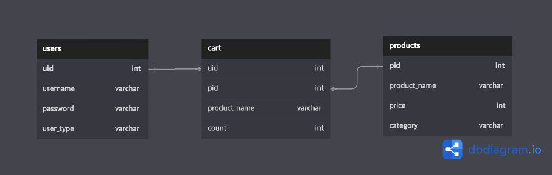

# Fastify CLI로 만들어보는 쇼핑몰  앱

[Fastify-CLI](https://github.com/fastify/fastify-cli)로 만들었습니다.

## 실행 방법

플젝 디렉토리에서

### `npm run dev`
* [http://localhost:3000](http://localhost:3000)에서 dev mode로 서버가 작동합니다.

### `npm start`
* Production mode로 동작합니다.

### `npm run test`
* 미리 정의된 테스트를 실행합니다.

## ERD

